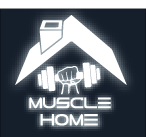
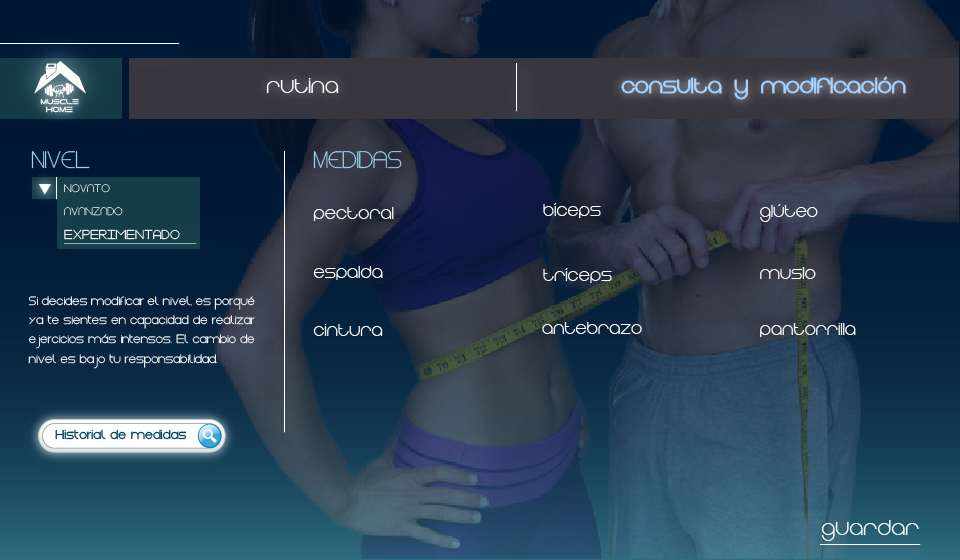

# Muscle Home

  

muscle home is a desktop app developed with home exercisers in mind. It has three levels of training, beginner, intermediate and advanced.

This application was developed in Java and SQLite.

You can use this project and its as you want.

### Track your measures 

### Select your level

For more docs information, goes to [docs section](assets/docs)